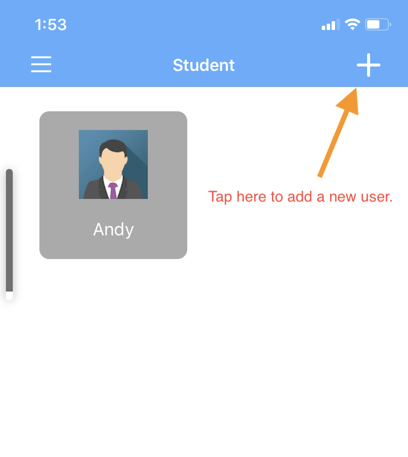
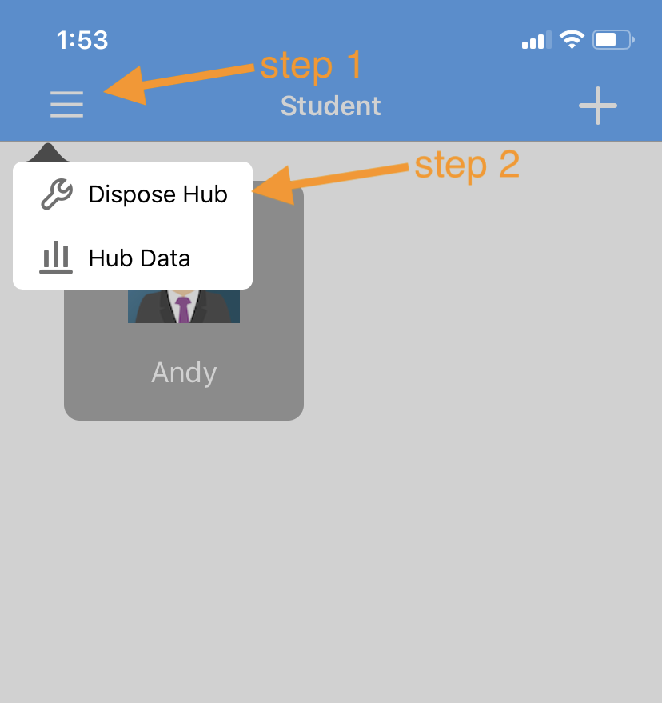
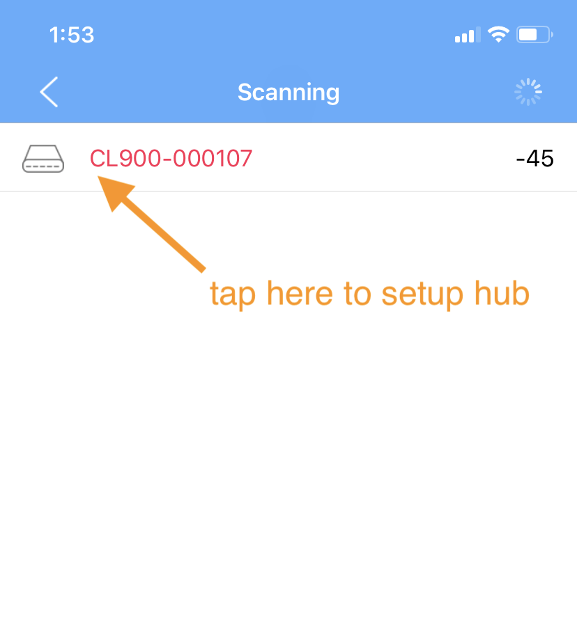
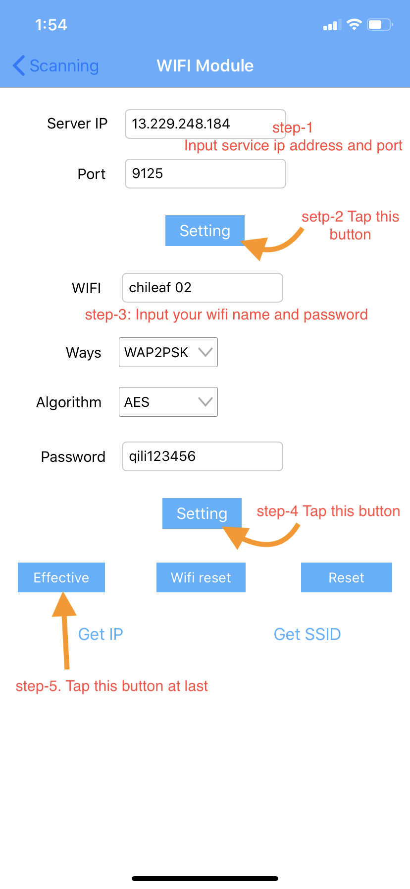
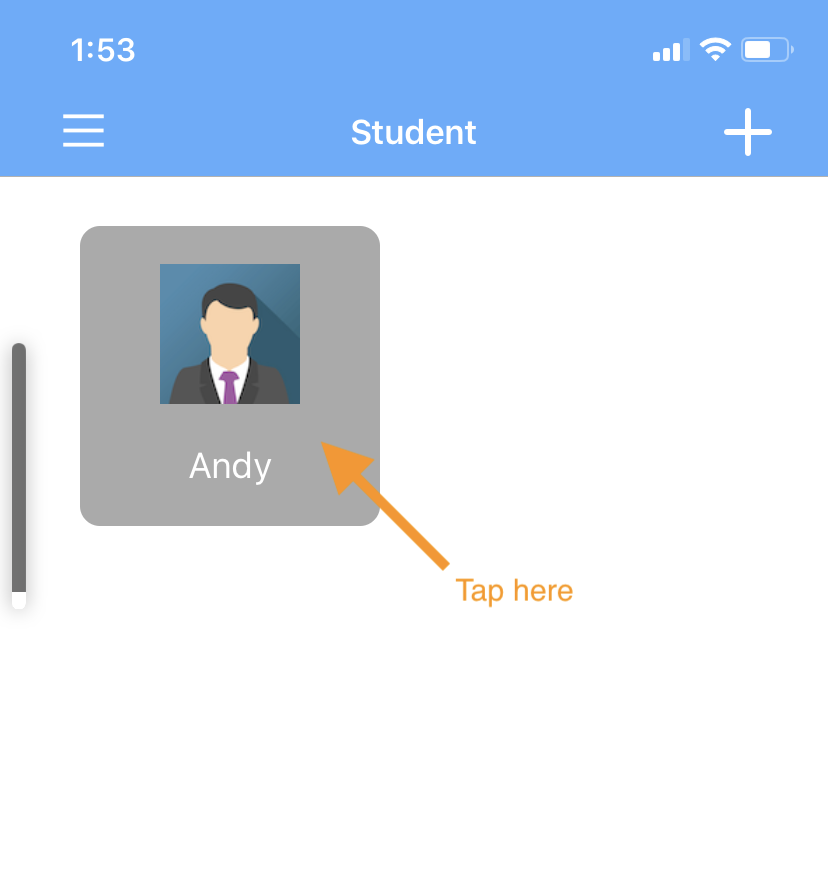
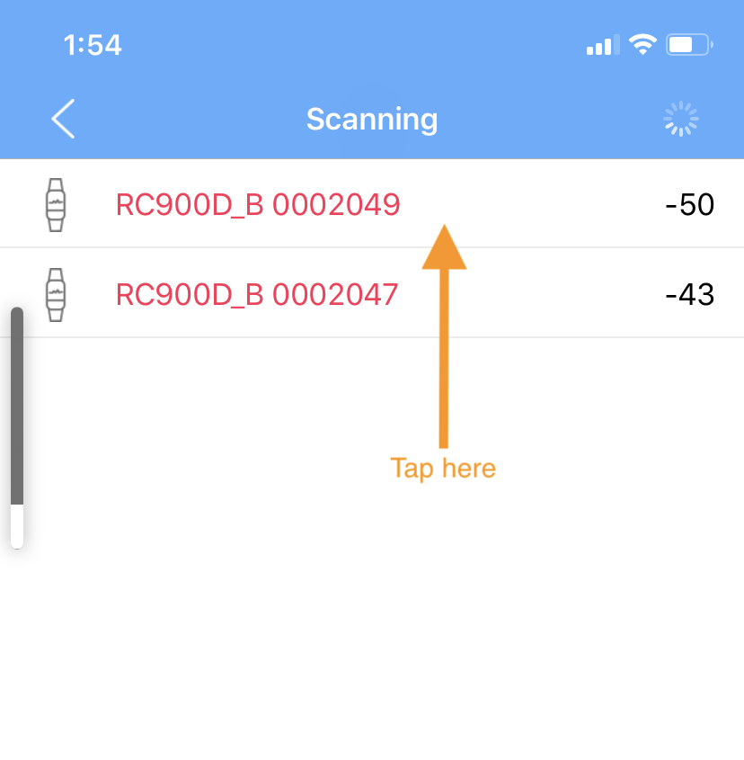
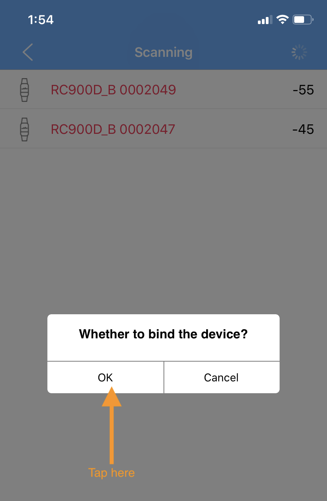
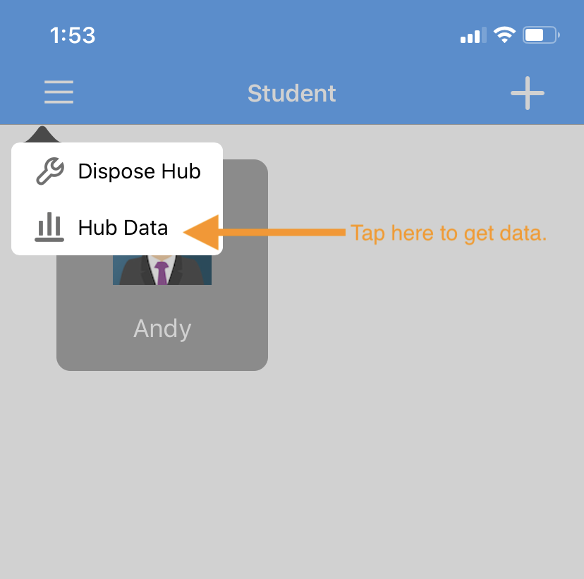
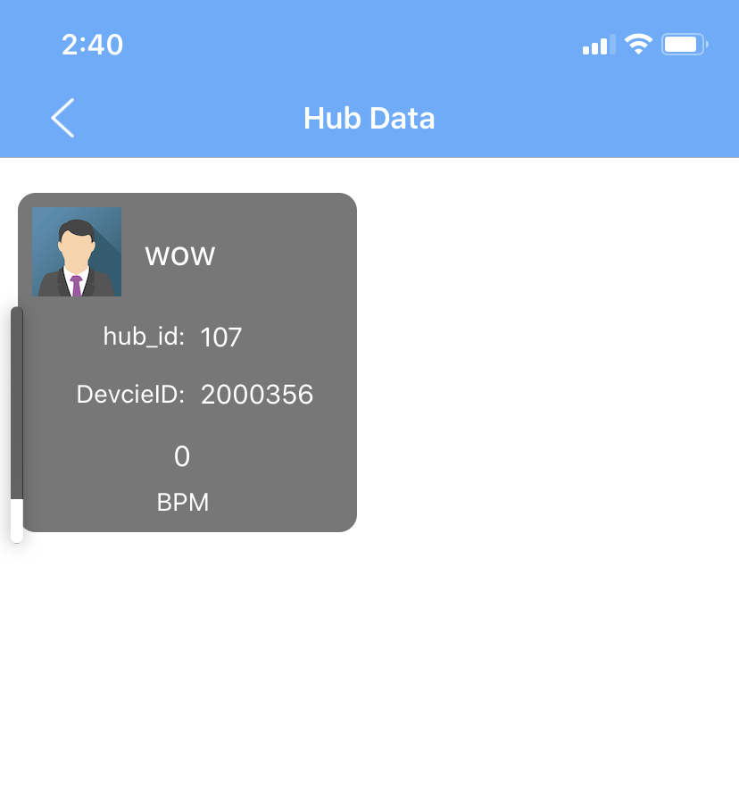

# Instructions

## Download app

1. iOS App.
2. android TV App.

## How to install iOS App

 Scan the QR code and enter the password 123456


## How to install Android App

 Scan the QR code and enter the password 1111


Download the Android installation package at ```https://www.pgyer.com/COACHTV``` and copy it to the Android TV or Android tablet. Install the corresponding installation package and open it.

## iOS App Operation Instructions

1. Configure the hub to the network. After the network is successfully configured, the hub transmits the collected data to the background via wifi.
2. Add user information.
3. Bind the added user information to the searched heart rate device.
4. Display bound device data

## Add user information



## Configure hub wifi connection

step-01:


step-02:


step-03:


## Binding the bracelet device

step-01:


step-02:


step-03:


step-04:


step-05:

