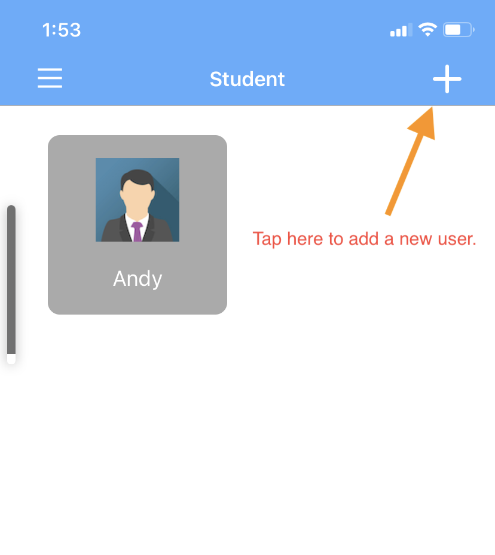
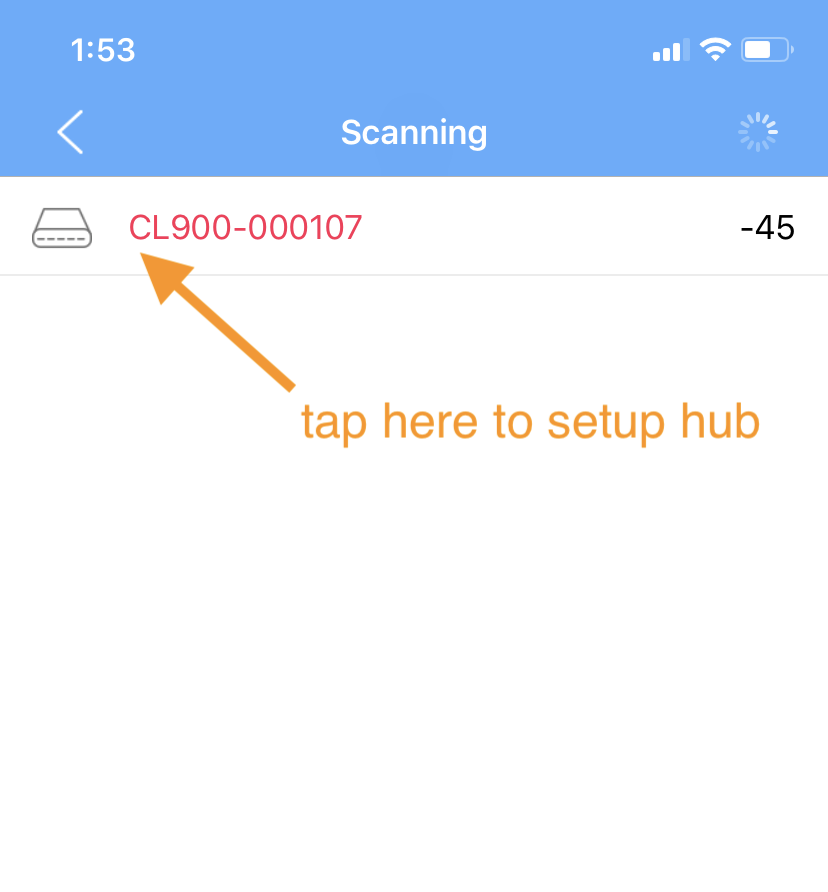
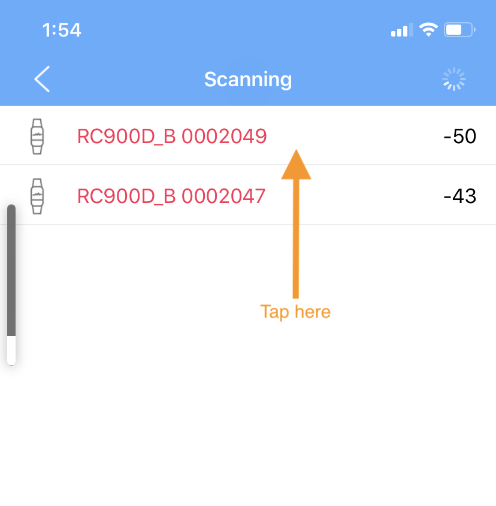

# 操作说明

## 下载 app

1. iOS App.
2. android TV App.

## iOS 下载说明

1. 扫描二维码，并输入密码 123456。

扫描下方二维码

## iOS App 操作说明

1. 给 hub 配网, 配网成功后，hub 通过 wifi 将收集到的数据传递到后台。
2. 添加用户信息。
3. 将添加的用户信息绑定到搜索到的心率设备。
4. 现实绑定的设备数据。

## 添加用户信息

## 绑定设备

step-01:

step-02:

step-03:

## 绑定手环设备

step-01:

step-02:

step-03:

step-04:

step-05:

